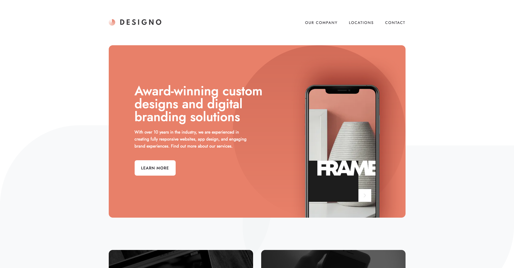

# Frontend Mentor - Designo agency website solution

This is a solution to the [Designo agency website challenge on Frontend Mentor](https://www.frontendmentor.io/challenges/designo-multipage-website-G48K6rfUT). Frontend Mentor challenges help you improve your coding skills by building realistic projects.

## Table of contents

- [Overview](#overview)
  - [The challenge](#the-challenge)
  - [Screenshot](#screenshot)
  - [Links](#links)
- [My process](#my-process)
  - [Built with](#built-with)
  - [What I learned](#what-i-learned)

## Overview

### The challenge

ユーザーができること:

- デバイスの画面サイズに応じて、サイトに最適なレイアウトを表示します
- ページ上のすべてのインタラクティブ要素のホバー状態を確認できる
- コンタクトフォームが送信された時、以下のエラーがある場合エラーメッセージを受け取る:
  - 名前、メールアドレス、メッセージ内容が空白の時
  - メールアドレスのフォーマットが正しくない時

### Screenshot

### Links

- Solution URL: [リンク](https://github.com/Kaji1127/designo-multi-page-website/)
- Live Site URL: [リンク](https://designo-multi-page-website-wheat.vercel.app/)

## My process

### Built with

- Next.js
- Flexbox
- CSS Grid
- モバイルファースト

### What I learned

初めて Next.js を使って Web サイトを作った。StaticSiteGeneration(SSG)を実装する方法について学ぶことができた。
